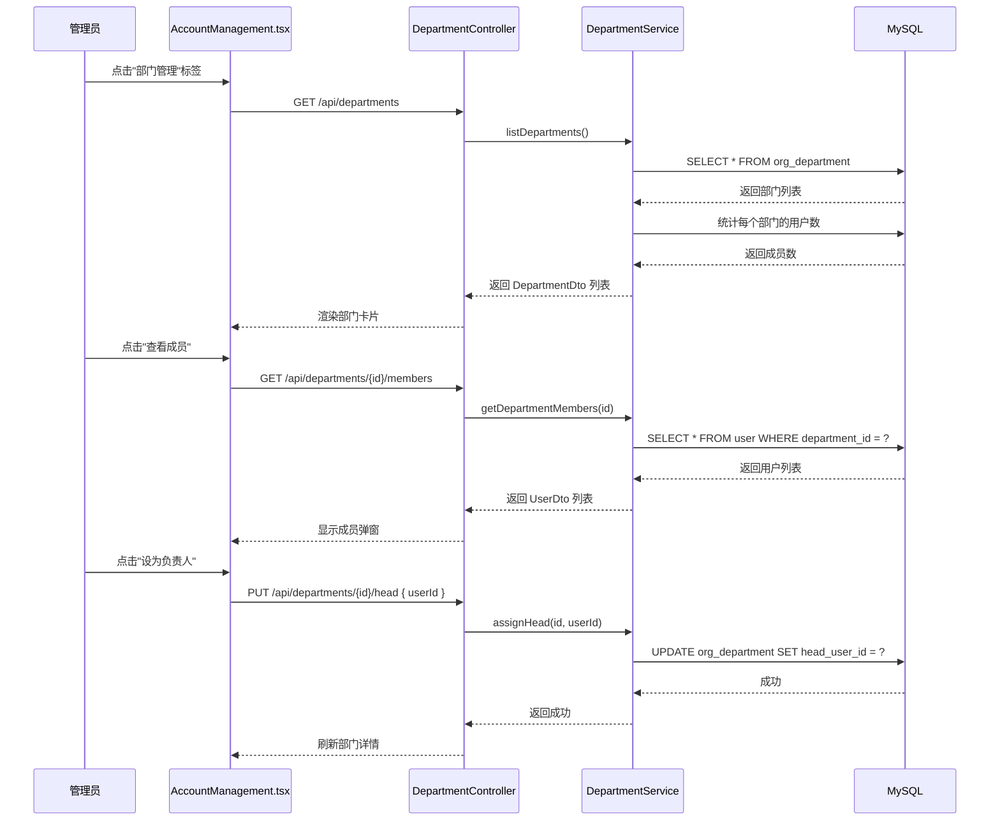

# 部门管理功能实施计划

## 概述

在用户管理界面添加部门管理功能，包括：
1. 插入10个预定义部门
2. `user` 表添加 `department_id` 字段关联部门
3. 后端新增部门管理 API（CRUD + 指派负责人）
4. 前端 AccountManagement.tsx 添加部门管理按钮、弹窗、新建用户部门选择

---

## 1. 数据库变更

### 1.1 `org_department` 表添加 `head_user_id` 字段

`org_department` 表已存在，需要添加 `head_user_id` 字段记录部门负责人。

```sql
-- org_department 表添加 head_user_id 字段
CALL sp_add_column_if_not_exists('org_department', 'head_user_id',
    'head_user_id BIGINT UNSIGNED DEFAULT NULL COMMENT ''部门负责人用户ID''');
```

### 1.2 `user` 表添加 `department_id` 字段

```sql
-- user 表添加 department_id 字段
CALL sp_add_column_if_not_exists('user', 'department_id',
    'department_id BIGINT UNSIGNED DEFAULT NULL COMMENT ''所属部门ID''');
```

### 1.3 插入10个部门数据

| dept_code | dept_name | dept_type | 说明 |
|-----------|-----------|-----------|------|
| SYSTEM | System | OTHER | 系统管理员、测试用户等 |
| PMC | 项目管理委员会 | OTHER | 项目管理委员会 |
| PM | 项目经理组 | OTHER | 项目经理组 |
| CHEMISTRY | 新药化学部 | PDT | 新药化学部 |
| BIOLOGY | 新药生物部 | PDT | 新药生物部 |
| CLINICAL | 新药临床部 | PDT | 新药临床部 |
| INFO | 新药资讯部 | PDT | 新药资讯部 |
| BD | 商务拓展部 | ROSS | 商务拓展部 |
| EFFICIENCY | 效率管理部 | ROSS | 效率管理部 |
| REGULATORY | 药政合规部 | ROSS | 药政合规部 |

---

## 2. 后端变更

### 2.1 `User.java` 实体修改

```java
// 新增字段
@ManyToOne(fetch = FetchType.LAZY)
@JoinColumn(name = "department_id")
private OrgDepartmentEntity department;

// Getter/Setter
public OrgDepartmentEntity getDepartment() { return department; }
public void setDepartment(OrgDepartmentEntity department) { this.department = department; }
```

### 2.2 `UserDto.java` 修改

```java
// 新增字段
private Long departmentId;
private String departmentName;

// Getter/Setter
public Long getDepartmentId() { return departmentId; }
public void setDepartmentId(Long departmentId) { this.departmentId = departmentId; }
public String getDepartmentName() { return departmentName; }
public void setDepartmentName(String departmentName) { this.departmentName = departmentName; }

// fromEntity 方法修改
public static UserDto fromEntity(User user) {
    UserDto dto = new UserDto();
    // ... 原有字段 ...
    if (user.getDepartment() != null) {
        dto.setDepartmentId(user.getDepartment().getId());
        dto.setDepartmentName(user.getDepartment().getDeptName());
    }
    return dto;
}
```

### 2.3 `UserController.java` 修改

`CreateUserRequest` 添加 `departmentId` 字段：

```java
public static class CreateUserRequest {
    // ... 原有字段 ...
    private Long departmentId;
    
    public Long getDepartmentId() { return departmentId; }
    public void setDepartmentId(Long departmentId) { this.departmentId = departmentId; }
}
```

`createUser` 方法添加部门设置逻辑：

```java
// 设置部门
if (request.getDepartmentId() != null) {
    OrgDepartmentEntity dept = orgDepartmentRepository.findById(request.getDepartmentId())
            .orElseThrow(() -> new ApiException(400, "部门不存在"));
    user.setDepartment(dept);
}
```

`CurrentUserInfo` 添加部门信息：

```java
private Long departmentId;
private String departmentName;
```

### 2.4 新建 `DepartmentDto.java`

```java
package com.kbd.pms.dto;

import com.kbd.pms.entity.OrgDepartmentEntity;
import java.time.Instant;

public class DepartmentDto {
    private Long id;
    private String deptCode;
    private String deptName;
    private String deptType;
    private Long parentId;
    private Boolean isActive;
    private Long headUserId;       // 负责人用户ID
    private String headUserName;   // 负责人用户名
    private int memberCount;       // 部门成员数
    private Instant createdAt;
    private Instant updatedAt;
    
    // Getters/Setters + fromEntity 方法
}
```

### 2.5 新建 `DepartmentService.java`

```java
@Service
public class DepartmentService {
    
    @Autowired
    private OrgDepartmentRepository deptRepository;
    @Autowired
    private UserRepository userRepository;
    
    // 获取所有部门列表（含成员数和负责人信息）
    public List<DepartmentDto> listDepartments() { ... }
    
    // 获取部门详情（含成员列表）
    public DepartmentDetailDto getDepartmentDetail(Long deptId) { ... }
    
    // 指派部门负责人
    public void assignHead(Long deptId, Long userId) { ... }
    
    // 获取部门成员列表
    public List<UserDto> getDepartmentMembers(Long deptId) { ... }
}
```

### 2.6 新建 `DepartmentController.java`

```java
@RestController
@RequestMapping("/api/departments")
public class DepartmentController {
    
    @Autowired
    private DepartmentService departmentService;
    
    // GET /api/departments - 获取所有部门列表
    @GetMapping
    @PreAuthorize("hasRole('ADMIN')")
    public ResponseEntity<Result<List<DepartmentDto>>> listDepartments() { ... }
    
    // GET /api/departments/{id} - 获取部门详情（含成员）
    @GetMapping("/{id}")
    @PreAuthorize("hasRole('ADMIN')")
    public ResponseEntity<Result<DepartmentDetailDto>> getDepartmentDetail(@PathVariable Long id) { ... }
    
    // PUT /api/departments/{id}/head - 指派部门负责人
    @PutMapping("/{id}/head")
    @PreAuthorize("hasRole('ADMIN')")
    public ResponseEntity<Result<Void>> assignHead(@PathVariable Long id, @RequestBody Map<String, Long> body) { ... }
    
    // GET /api/departments/{id}/members - 获取部门成员
    @GetMapping("/{id}/members")
    @PreAuthorize("hasRole('ADMIN')")
    public ResponseEntity<Result<List<UserDto>>> getDepartmentMembers(@PathVariable Long id) { ... }
}
```

### 2.7 `UserRepository.java` 添加查询方法

```java
List<User> findByDepartmentId(Long departmentId);
```

---

## 3. 前端变更

### 3.1 `UserInfo` 接口添加部门字段

```typescript
interface UserInfo {
  // ... 原有字段 ...
  departmentId?: number;
  departmentName?: string;
}
```

### 3.2 添加 `DepartmentInfo` 接口

```typescript
interface DepartmentInfo {
  id: number;
  deptCode: string;
  deptName: string;
  deptType: string;
  isActive: boolean;
  headUserId?: number;
  headUserName?: string;
  memberCount: number;
}
```

### 3.3 标签切换区添加"部门管理"按钮

在 `activeTab` 状态中添加 `'departments'` 选项：

```typescript
const [activeTab, setActiveTab] = useState<'users' | 'roles' | 'departments'>('users');
```

在"用户管理"和"权限组设置"按钮之间插入：

```tsx
<Button
  variant={activeTab === 'departments' ? 'default' : 'outline'}
  onClick={() => setActiveTab('departments')}
  className={activeTab === 'departments' ? 'bg-blue-600' : 'border-slate-600 text-slate-300'}
>
  <Building2 className="w-4 h-4 mr-2" />
  部门管理
</Button>
```

### 3.4 部门管理面板

在用户管理面板和权限组设置面板之间添加部门管理面板：

```tsx
{activeTab === 'departments' && isAdmin && (
  <div>
    <h2 className="text-xl font-semibold mb-4">部门管理</h2>
    <div className="grid gap-4">
      {departments.map(dept => (
        <Card key={dept.id} className="bg-slate-800 border-slate-600">
          <CardHeader>
            <div className="flex items-center justify-between">
              <div>
                <CardTitle>{dept.deptName}</CardTitle>
                <p className="text-sm text-slate-400">编码: {dept.deptCode}</p>
              </div>
              <Button onClick={() => openDeptDetail(dept)}>
                查看成员
              </Button>
            </div>
          </CardHeader>
          <CardContent>
            <p>成员数: {dept.memberCount}</p>
            <p>负责人: {dept.headUserName || '未设置'}</p>
          </CardContent>
        </Card>
      ))}
    </div>
  </div>
)}
```

### 3.5 部门详情弹窗

点击"查看成员"后弹出，显示部门成员列表，并可以指派负责人：

```tsx
{showDeptDetail && (
  <div className="fixed inset-0 bg-black/50 flex items-center justify-center z-50">
    <div className="bg-slate-800 rounded-lg p-6 w-full max-w-2xl border border-slate-600">
      {/* 部门标题 */}
      {/* 成员表格：ID、用户名、邮箱、角色、操作（设为负责人） */}
      {/* 当前负责人显示 */}
    </div>
  </div>
)}
```

### 3.6 新建账号弹窗添加部门选择

在角色选择区域下方添加：

```tsx
<div>
  <label className="block text-sm text-slate-400 mb-2">所属部门</label>
  <select
    value={newUser.departmentId || ''}
    onChange={e => setNewUser({ ...newUser, departmentId: Number(e.target.value) || undefined })}
    className="w-full bg-slate-700 border border-slate-600 text-white rounded px-3 py-2"
  >
    <option value="">无部门</option>
    {departments.map(dept => (
      <option key={dept.id} value={dept.id}>{dept.deptName}</option>
    ))}
  </select>
</div>
```

### 3.7 用户表格添加"所属部门"列

在"角色"列和"状态"列之间插入：

```tsx
<th className="text-left p-4">所属部门</th>
// ...
<td className="p-4 text-sm text-slate-400">{u.departmentName || '-'}</td>
```

---

## 4. 数据流



---

## 5. 涉及文件清单

### 数据库
- `db/alter_add_department_management.sql` (新建)

### 后端
| 文件 | 操作 | 说明 |
|------|------|------|
| `backend/.../entity/User.java` | 修改 | 添加 `department` 字段 + `@ManyToOne` |
| `backend/.../dto/UserDto.java` | 修改 | 添加 `departmentId`/`departmentName` |
| `backend/.../web/UserController.java` | 修改 | `CreateUserRequest` 添加 `departmentId` |
| `backend/.../dto/DepartmentDto.java` | 新建 | 部门 DTO |
| `backend/.../service/DepartmentService.java` | 新建 | 部门业务逻辑 |
| `backend/.../web/DepartmentController.java` | 新建 | 部门 REST API |
| `backend/.../repository/UserRepository.java` | 修改 | 添加 `findByDepartmentId` |
| `backend/.../entity/OrgDepartmentEntity.java` | 修改 | 添加 `headUserId` 字段 |

### 前端
| 文件 | 操作 | 说明 |
|------|------|------|
| `frontend/src/pages/AccountManagement.tsx` | 修改 | 添加部门管理标签、弹窗、部门选择 |

---

## 6. 实施顺序

1. **数据库 SQL 脚本** → 先创建 `alter_add_department_management.sql`
2. **后端实体和 DTO** → `User.java`、`UserDto.java`、`OrgDepartmentEntity.java`
3. **后端 Service 和 Controller** → `DepartmentService.java`、`DepartmentController.java`
4. **后端 UserController 修改** → `CreateUserRequest` 添加 `departmentId`
5. **前端 AccountManagement.tsx** → 所有 UI 修改
6. **执行 SQL 脚本** → 插入部门数据
7. **编译验证** → `mvn compile` + `npx tsc --noEmit`
8. **启动测试** → 验证功能正常
